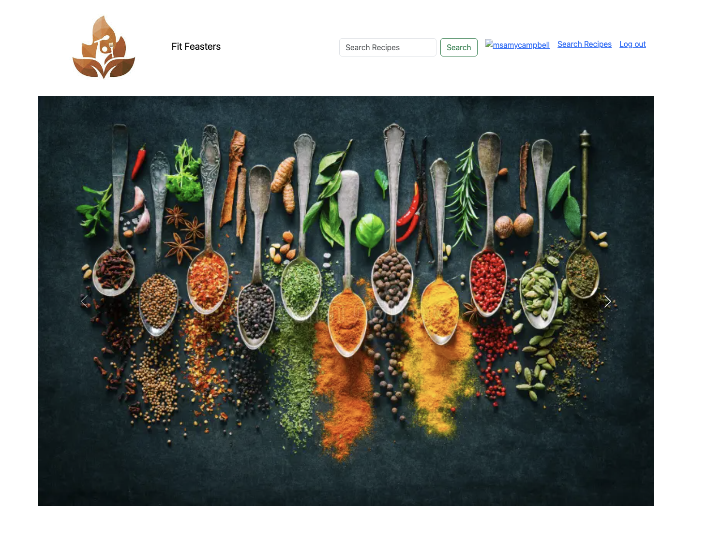
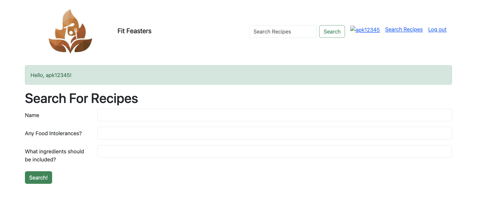
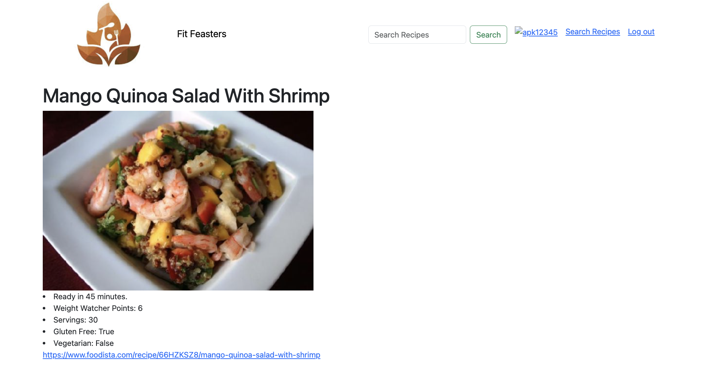

# FitFeasters
Nutritional info and recipes for foodies at home.

Welcome to Fit Feasters! FitFeasters is a web application built with Flask, designed to help users discover recipes based on their dietary preferences and ingredients they have on hand. User has inputs for the food name, any food intolerances (optional), and any ingredients which should be included (optional). That avocado is perfectly ripe, time to get recipes! User can also look up food recipe in the search box. After searching, the user is given 5 food images, clicking on one of the food links, the user is brought to a new page and given:
- Time to prepare meal
- Weight Watcher Points
- How many servings
- If the meal is gluten free
- If the meal is vegetarian
- A link to the meal's recipe 

Screenshots of Fit Feasters

  
   
 

link to api---> https://api.spoonacular.com

Getting Started:
To get started with FitFeasters locally, follow these steps in the terminal:

Prerequisites:
Make sure you have the following installed on your machine:

Python (3.6 or higher)
Flask
Jinja
SQLAlchemy

Installation:
-Go to this repository to your local machine:

    https://github.com/courtneydaly1/FitFeasters.git 

Navigate to the project directory:

    cd fitfeasters

Install the required Python packages:

    pip install -r requirements.txt

Create the database in the terminal:
    createdb fitfeasters_db

Configuration:
Obtain an API key from Spoonacular by signing up .

Replace API_KEY in app.py with your Spoonacular API key.

Run the Flask application:

    flask run 

Open your web browser and navigate to http://localhost:5000 to access FitFeasters.

Usage:

Signup/Login: Create an account or login with existing credentials to start using the app.
Search for Recipes: Use the search form to find recipes based on titles, ingredients, and dietary preferences.
Update Profile: Update your profile information, including username, email, and profile picture.
Logout: Logout from your account when you're done using the app.

Future Features:

Save Recipes: Save your favorite recipes to your profile for easy access later.